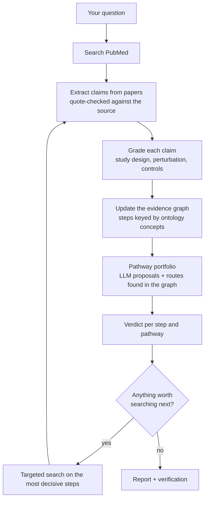

# B-MiRA — Biomedical Mechanism Inference Research Agent

**v2.0** · LangGraph · Python 3.10+

Ask *"Does X affect Y, and through which mechanisms?"*. B-MiRA searches PubMed, extracts claims from papers, grades the evidence, and weighs **several candidate pathways against each other** before writing a report in which every sentence is tied to a cited claim.

> Research tool for exploring literature. Not medical advice, and not a substitute for reading the papers.

---

## Why it is built this way

| Common failure of literature agents | What B-MiRA does instead |
|---|---|
| Commits to the first mechanism it imagines | Keeps a **portfolio** of competing pathways and spends search effort on the ones that could change the ranking |
| Re-invents the hypothesis every round, so results drift | Each pathway step has a stable identity, so evidence **accumulates** across rounds |
| Overstates weak evidence | Every claim is **graded**; report wording is **checked** against the grade of the claims it cites |
| Hides gaps and failures | Gaps, contradictions and degraded runs are **stated in the report** |

## How it works



**The evidence graph.** Every claim like *"lactate lowers NAD⁺ in CD8 T cells"* becomes an edge between two concepts. Supporting, corroborating and opposing papers attach to the same edge, so a step's evidence is shared by every pathway that uses it.

**The pathway portfolio.** Candidate pathways come from three places:
1. **LLM proposals**: once, after the first search round, the model proposes a few pathways that must differ in their intermediate steps.
2. **The literature graph**: code finds exposure → outcome routes that the evidence already connects, even if no one proposed them.
3. **Gated expansion**: when a new intermediate appears in ≥ 2 papers, the model may add at most one pathway through it.

**Scoring.** A pathway is only as strong as its weakest step. Biological logic checks (sign consistency, connectivity, cell-type coherence) lower the score of implausible pathways. Scores **rank** pathways; they are not probabilities.

### Verdicts

Every step and every pathway gets one of three verdicts, each with a one-line reason:

| Verdict | Meaning |
|---|---|
| **Supported** | Every step has ≥ 2 independent papers, and opposing papers are fewer than half |
| **Contradicted** | Opposing papers from comparable systems make up at least half, at moderate grade or better |
| **Insufficient evidence** | Anything else, e.g. *"1 of 2 required papers"* or *"no study found after repeated searches"* |

"No study found after repeated searches" is worth noticing: it often marks an untested hypothesis rather than a wrong one.

## Quick start

```bash
git clone https://github.com/jung-hankyo/bmira-biomechanism-agent.git
cd bmira-biomechanism-agent
pip install -r requirements.txt
```

**1. Try it offline (no keys, no network).** A synthetic scenario and a scripted model exercise the whole pipeline:

```bash
python -m pytest -q tests          # 14 tests
streamlit run app.py               # choose "Offline demo" in the sidebar
```

**2. Run it live.** Choose *Live* in the app's sidebar and enter an OpenAI or Anthropic API key and your NCBI email. Or set them once:

```bash
export OPENAI_API_KEY=...           # or ANTHROPIC_API_KEY
export NCBI_EMAIL=you@example.org   # NCBI asks for a contact address
export NCBI_API_KEY=...             # optional, raises PubMed rate limits
```

### Using the chat app

| You type | B-MiRA does |
|---|---|
| A mechanism question | Runs a full investigation and shows the ranked pathways, the report and the run log |
| A follow-up (*"why is route 2 contradicted?"*) | Answers **only** from that run's evidence, citing claim IDs; flags any sentence that overstates the evidence |
| `/new <question>` | Starts a fresh investigation |

The report and the run state can be downloaded as Markdown and JSON.

### Using the notebook

`B-MiRA_workflow.ipynb` runs the same pipeline step by step with inspection tables (pathways per round, step evidence, claim ledger) and is the easiest way to see *why* the agent reached its conclusion.

## Repository layout

```
app.py                    Streamlit chat interface
B-MiRA_workflow.ipynb     Walk-through notebook
bmira/
  config.py               All tunable settings (one dataclass)
  schemas.py              Data models and controlled vocabularies
  llm.py                  Prompts and the LLM client
  sources.py              PubMed and Europe PMC access
  normalize.py            Entity resolution, synonyms, relation typing, quote checking
  evidence.py             Claim grading and report verification
  semantic.py             Which claims report the same finding; conflict triage
  portfolio.py            Evidence graph, verdicts, scoring, search allocation
  graph.py                The LangGraph pipeline and report
  chat.py                 Follow-up answers grounded in a finished run
  offline.py              Scripted model + synthetic corpus for key-free runs
  fixtures/               Synthetic test scenario (invented papers)
tests/test_bmira.py       One test per design guarantee
```

## Main settings

All in `bmira/config.py`; the app exposes the round limit.

| Setting | Default | Effect |
|---|---|---|
| `max_rounds` | 5 | Upper bound on search rounds |
| `min_studies_per_link` | 2 | Independent papers needed for a step to be Supported |
| `n_seed_hypotheses` / `max_hypotheses` | 4 / 6 | Pathways proposed at the start / kept at once |
| `targets_per_round` / `exploration_slots` | 3 / 1 | Steps searched per round / slots reserved for non-leading pathways |
| `max_extract_per_round` | 10 | Papers read per round (the rest wait, they are not dropped) |

## Limitations

- **Live paths are not yet validated end to end.** The offline tests prove the pipeline's logic; they do not prove extraction accuracy on real papers. Validation against an expert-annotated gold set is the next milestone.
- Grade weights and thresholds are reasoned defaults, not calibrated values.
- The relation vocabulary (11 relations) cannot express dose, timing or compositional effects; those stay in the claim's context fields.
- Only open-access full texts are read; everything else is abstract-only, which caps the evidence grade.

## Versioning

**v2.0.0** is the first public release. It consolidates the internal prototypes (single-notebook versions 5–12) into a tested package, replaces the single mechanism chain with the pathway portfolio, and adds the chat interface.

## License

No license has been chosen yet, so all rights are reserved by default. Open an issue if you would like to reuse the code.
