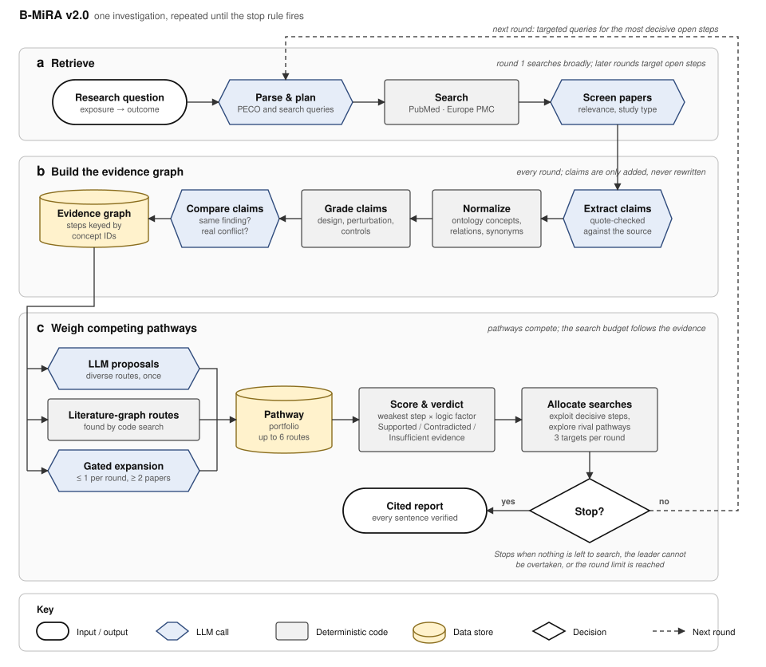

# B-MiRA — Biomedical Mechanism Inference Research Agent

**v2.5** · LangGraph · Python 3.10+

Ask *"Does X affect Y, and through which mechanisms?"*. B-MiRA searches PubMed, extracts claims from papers, grades the evidence, and weighs **several candidate pathways against each other** before writing a report in which every sentence is tied to a cited claim.

> Research tool for exploring literature. Not medical advice, and not a substitute for reading the papers.

---

## Why it is built this way

| Common failure of literature agents | What B-MiRA does instead |
|---|---|
| Commits to the first mechanism it imagines | Keeps a **portfolio** of competing pathways and spends search effort on the ones that could change the ranking |
| Re-invents the hypothesis every round, so results drift | Each pathway step has a stable identity, so evidence **accumulates** across rounds |
| Overstates weak evidence | Every claim is **graded** on what its text actually shows; report wording is **checked** against the grade of the claims it cites |
| Trusts the model's reading of a paper | Each claim's quote must exist in the paper, name both entities and match the claim's direction; method details count only if the text shows them |
| Hides gaps and failures | Gaps, contradictions and degraded runs are **stated in the report** |

## How it works

<p align="center"></p>

**Figure 1 | B-MiRA architecture.** **a**, A question is parsed into search queries; PubMed and Europe PMC are searched and papers are screened. **b**, Claims are extracted and checked against their quotes, normalized to ontology concepts, graded per claim, and compared into a shared evidence graph. **c**, Candidate pathways from three sources compete: each is scored by its weakest step and given a verdict, and the next searches go to the steps that would most change the ranking. The loop repeats until the stop rule fires; a report is then written and every sentence is verified. Hexagons are LLM calls, rectangles are deterministic code. A 2× PNG for slides and papers is in [`docs/figure1.png`](docs/figure1.png).

**The evidence graph.** Every claim like *"lactate lowers NAD⁺ levels in CD8 T cells"* becomes an edge between two entities (*lactate → NAD⁺*). How the entity was measured (*levels*, *expression*, *differentiation*) and where (*colon*, *bone marrow*) are qualifiers on the claim, not part of the node: "induction of colonic regulatory T cells", "Treg differentiation" and "bone marrow Treg cells" all meet at *regulatory T cell*. Lists such as "NFAT1 and SMAD3" become one claim per entity; ontology terms prefer species-agnostic entries, then human, mouse, rat. Supporting, corroborating and opposing papers attach to the same edge, so a step's evidence is shared by every pathway that uses it.

**The pathway portfolio.** Candidate pathways come from three places:
1. **LLM proposals**: once, after the first search round, the model proposes a few pathways that must differ in their intermediate steps.
2. **The literature graph**: code finds exposure → outcome routes that the evidence already connects, even if no one proposed them.
3. **Gated expansion**: when a new intermediate appears in ≥ 2 papers, the model may add at most one pathway through it.

**Scoring.** A pathway is only as strong as its weakest step. Biological logic checks (sign consistency, connectivity, cell-type coherence) lower the score of implausible pathways. Scores **rank** pathways; they are not probabilities.

### Verdicts

Every step and every pathway gets one of three verdicts, each with a one-line reason:

| Verdict | Meaning |
|---|---|
| **Supported** | Every step has ≥ 2 independent primary papers, at least one of moderate grade or better, and opposing papers are fewer than half |
| **Contradicted** | Counted opposing papers make up at least half, at moderate grade or better |
| **Insufficient evidence** | Anything else, e.g. *"1 of 2 required papers"*, *"only weak evidence"* or *"no study found in 2 targeted searches"* |

"No study found in 2 targeted searches" is worth noticing: it often marks an untested hypothesis rather than a wrong one. It is only stated after two clean searches whose hits were all read for that step.

### Evidence rules

Fixed rules, applied by code rather than by the model, decide what counts:

| Rule | What it prevents |
|---|---|
| A claim's quote must appear in the paper, name both entities, and agree with the claim's direction (a "no" or "did not" cannot be added or dropped) | Misread or invented findings |
| Perturbation, rescue, validation and control details count only if the quote or a quoted methods sentence shows them | Inflated grades |
| Each claim is graded by its own experimental system (one paper can hold mouse and human data) | Paper-level mislabelling |
| Evidence from a system further from the question's population (e.g. mouse for a human question) is capped at moderate | Over-reliance on indirect models |
| Reviews are shown but never count as independent papers | Double-counting the same finding |
| A null result counts against a step only if it had a control and is at least as strong as the support | Underpowered nulls erasing real effects |
| An opposing finding is set aside as "different context" only if the recorded contexts really differ and it does not come from a system closer to humans | Explaining away contradictions |
| Papers found for a step are read for that step before it can be called unfound | False "no study found" |

## Quick start

```bash
git clone https://github.com/jung-hankyo/bmira-biomechanism-agent.git
cd bmira-biomechanism-agent
pip install -r requirements.txt
```

**1. Try it offline (no keys, no network).** A synthetic scenario and a scripted model exercise the whole pipeline:

```bash
python -m pytest -q tests          # 54 tests
streamlit run app.py               # choose "Offline demo" in the sidebar
```

**2. Run it live.** Choose *Live* in the app's sidebar and enter an OpenAI or Anthropic API key and your NCBI email. Or set them once:

```bash
export OPENAI_API_KEY=...           # or ANTHROPIC_API_KEY
export NCBI_EMAIL=you@example.org   # NCBI asks for a contact address
export NCBI_API_KEY=...             # optional, raises PubMed rate limits
```

### Using the chat app

| You type | B-MiRA does |
|---|---|
| A mechanism question | Runs a full investigation and shows the ranked pathways, the report and the run log |
| A follow-up (*"why is route 2 contradicted?"*) | Answers **only** from that run's evidence, citing claim IDs; flags any sentence that overstates the evidence |
| `/new <question>` | Starts a fresh investigation |

The report and the run state can be downloaded as Markdown and JSON.

### Running experiments

```bash
python -m bmira.experiments                        # the 8 questions in experiments/questions.txt
python -m bmira.experiments --only 1 2 --max-rounds 3
python -m bmira.experiments --budget-tokens 2000000  # soft token cap per run
python -m bmira.experiments --offline              # wiring check, no keys
```

**Before spending,** a preflight (a few seconds) sends one tiny call to each configured model with the same parameters as real calls, one PubMed search and one ontology lookup; a required failure aborts the session (`--no-preflight` skips it). **During a run,** rate limits, overloads and timeouts are retried with backoff; fatal errors (empty balance, invalid key, unknown model, unsupported parameter) stop the session at once instead of degrading silently. **A run that stops early is still summarized** from its last completed step, with `status`, `error` and `failed_node`, so paid work is never lost.

Each session writes **one** file, `runs/session_<timestamp>.json` (git-ignored), rewritten after every question. Per run it holds: LLM calls, tokens, latency and failures per task; queries and hits; screening and full-text rates; claims kept and dropped (with reasons and samples); uncredited method details; ontology resolution and synonym merges; grades and caps; claim comparisons and conflicts; step and pathway verdicts with reasons; leader per round; verification; warnings; the log tail; the report. Per LLM task it also records the model used, reasoning tokens and an estimated cost (from the price table in `config.py`). The session header records models, effort settings, budget, preflight results and whether the code had uncommitted edits. A `signals` list flags measured values that crossed a heuristic threshold, each naming the code to inspect. The chat app offers the same summary as a download.

### Using the notebook

`B-MiRA_workflow.ipynb` runs the same pipeline step by step with inspection tables (pathways per round, step evidence, claim ledger) and is the easiest way to see *why* the agent reached its conclusion.

## Repository layout

```
app.py                    Streamlit chat interface
experiments/questions.txt Eight experiment questions for live runs
docs/figure1.svg          Architecture figure (also .png)
B-MiRA_workflow.ipynb     Walk-through notebook
bmira/
  config.py               All tunable settings (one dataclass)
  schemas.py              Data models and controlled vocabularies
  llm.py                  Prompts and the LLM client
  sources.py              PubMed and Europe PMC access
  normalize.py            Entity resolution, synonyms, relation typing, quote checking
  evidence.py             Claim grading and report verification
  semantic.py             Which claims report the same finding; conflict triage
  portfolio.py            Evidence graph, verdicts, scoring, search allocation
  graph.py                The LangGraph pipeline and report
  chat.py                 Follow-up answers grounded in a finished run
  telemetry.py            Run metrics and revision signals
  experiments.py          Batch runner: questions in, one session summary file out
  offline.py              Scripted model + synthetic corpus for key-free runs
  fixtures/               Synthetic test scenario (invented papers)
tests/test_bmira.py       One test per design guarantee
LICENSE  CITATION.cff     MIT license; citation metadata
```

## Main settings

All in `bmira/config.py`; the app exposes the round limit.

| Setting | Default | Effect |
|---|---|---|
| `max_rounds` | 5 | Upper bound on search rounds |
| `min_studies_per_link` | 2 | Independent papers needed for a step to be Supported |
| `n_seed_hypotheses` / `max_hypotheses` | 4 / 6 | Pathways proposed at the start / kept at once |
| `targets_per_round` / `exploration_slots` | 3 / 1 | Steps searched per round / slots reserved for non-leading pathways |
| `max_extract_per_round` | 20 | Papers read per round; papers found for a step are read first, the rest wait |
| `max_papers_per_target_query` | 5 | Hits per targeted query (the coverage round takes 20); reading capacity, not search, is the limit |
| `min_relevance` | 50 | Screening score (0-100) a paper needs to be read; targeted hits are judged against their step |
| `cheap_tasks` | 9 classification tasks | Tasks routed to the cheap model (screening, entities, relations, aliases, pairs, conflicts, entailment) |
| `cache_dir` | `runs/cache` in live runs | Entity resolutions reused across runs |
| `max_claims_per_paper` | 8 | Claims taken from one paper (null and opposing findings are prioritized) |
| `temperature` | `None` | Sampling temperature; `None` uses each model's default (some reasoning models accept nothing else) |
| `reasoning_effort` | low / medium per task | OpenAI reasoning effort: low for classification tasks, medium for reading papers, planning and the report |
| `budget_tokens` | `None` | Soft token cap per run, checked between rounds; when reached, searching stops and the report is still written |
| `prices` | official list prices | USD per 1M tokens per model, used only for cost estimates in telemetry; edit to your current prices |
| `llm_max_retries` / `llm_timeout_s` | 6 / 180 s | Retries with backoff for transient LLM errors; per-call timeout |

## Limitations

- **Live paths are not yet validated end to end.** The offline tests prove the pipeline's logic; they do not prove extraction accuracy on real papers. Validation against an expert-annotated gold set is the next milestone.
- Grade weights and thresholds are reasoned defaults, not calibrated values.
- The relation vocabulary (11 relations) cannot express dose, timing or compositional effects; those stay in the claim's context fields.
- Only open-access full texts are read; everything else is abstract-only, which caps the evidence grade. Full texts are read section by section (Results, figure legends, Methods first).
- Cost estimates cover only models listed in `Settings.prices`; reasoning effort applies to OpenAI models only. The token budget is soft: the round in progress and the report can exceed it, so set a hard spend limit at the provider as well.
- Rules are checked offline with invented papers. Ontology routing (OLS) and the quote checks have not yet been measured on real papers, so expect some valid claims to be dropped as too strict.

## Versioning

**v2.0.0** is the first public release. It consolidates the internal prototypes (single-notebook versions 5–12) into a tested package, replaces the single mechanism chain with the pathway portfolio, and adds the chat interface. It was published without a license file.

**v2.0.1** adds the MIT license, citation metadata and the architecture figure.

**v2.1.0** hardens the evidence pipeline: claims are checked against their quotes, method details need textual support, grades are per claim with an indirectness cap, reviews no longer count as independent, null results and context arguments face explicit rules, targeted searches are read for their step, entities are separated from how they were measured, and retrieval retries and reads full texts by section. Expect fewer Supported and fewer "no study found" verdicts than v2.0; both are corrections.

**v2.2.0** adds run telemetry: token, latency and failure accounting per LLM task, a batch experiment runner that writes one session summary file, revision signals, and eight experiment questions.

**v2.2.1** registers B-MiRA's data types with LangGraph's checkpoint serializer, so runs keep working when newer LangGraph releases block unregistered types. Use v2.2.1 or later for live experiments.

**v2.4.0** fixes problems seen in the first live run. Graph nodes are entities, with measurement, process and tissue words kept as qualifiers. Lists are split into one claim per entity, and placeholders are rejected. Ontology choice is species-aware. The mention check accepts abbreviations the paper defines and the previous sentence. Targeted searches return fewer hits, judged against their step, with a relevance cut-off. Entity resolution is batched, parallel and cached across runs, and classification tasks run on the cheap model.

**v2.5.0** fixes problems seen in the third live run (pilot3, butyrate and Tregs). Pair comparison now matches verdicts by position, so conflicts can be found (0 of 227 pairs were judged before). Entity names are looked up before they become local ids, Greek letters and charges keep entities apart, and genotype notation stays whole. Method and comparator wording is recognised more widely, including trial wording, and a randomized trial with a control arm can grade strong. A finding on a subtype supports the link to its parent, and a null finding can contradict a required-for step. A decline or loss in the question ("NAD+ decline", "TET2 loss") is read as a decrease of the bare entity and the expected pathway sign follows it. Verification no longer flags cell names such as "induced regulatory T cells" or negated statements as overclaims. Session files hide the NCBI key and email and list every claim and step. Papers read per round: 10 to 20.

**v2.3.0** makes live runs safe to pay for: preflight checks, fatal-error abort, partial summaries for runs that stop early, per-task reasoning effort, a soft token budget, cost estimates, reasoning-token counts, and provenance of uncommitted edits. Log lines from parallel steps no longer merge.

**v2.2.2** stops sending a fixed temperature, which some reasoning models reject (`Settings.temperature`, default `None` = the model's own default), and makes file encodings explicit so tests pass on Windows.

## License

MIT. See [LICENSE](LICENSE). Dependencies keep their own licenses. Literature retrieved from PubMed, Europe PMC and the EBI Ontology Lookup Service is subject to those services' terms and is not stored in this repository. The papers in `bmira/fixtures/` are invented test data, not real literature.

## Citing

If B-MiRA helps your work, please cite it. GitHub's "Cite this repository" button reads [CITATION.cff](CITATION.cff).
